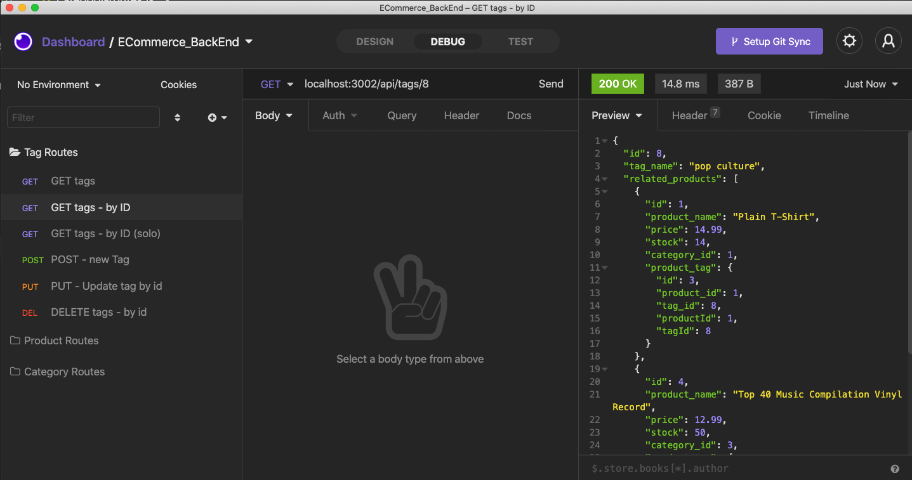

  # Project Name:

  E-Commerce Back End
  
  ## Link to Demo. (LOOK AT THIS!):
  
  - [Click Here](https://virginia.zoom.us/rec/share/wm18w7oKuaL8gJSGFfd-X9JmlyY4N9n_bEOeTy-vVS1z90Xd_WIz0b9LJdIVnZab.aC_Ka1xmCDCL6PBZ)
  - Passcode: ^Np#UQ+2

  ## License

   : [View License](https://www.gnu.org/licenses/gpl-3.0)

  ## Table of Contents

  - [Title](#Project-Name)
  - [License](#License)
  - [Description](#Description)
  - [Installation](#Installation)
  - [Usage](#Usage)
  - [Contributions](#Contributions)
  - [Tests](#Tests)
  - [Questions](#Questions)

  ## Description

  Our task is to build a back and for an e-commerce site. We will configure a working Express.js API to use Sequelize to interact with a MySQL database

  ## Installation

  Navigate to the root directory of this repository and run the following commands to install necessary dependencies:

    npm i

  To seed MySQL database with seed data, navigate to the root directory of this repository and run the following command:
  
    node seeds/index.js
 
 ## Usage

  

  ## Contributions 

  

  ## Tests 

  

  ## Questions 

  For issues, questions, and comments please contact epurpur@gmail.com or visit [https://github.com/epurpur](https://github.com/epurpur) 
  
  ## Preview of Application
  
  
  
  
